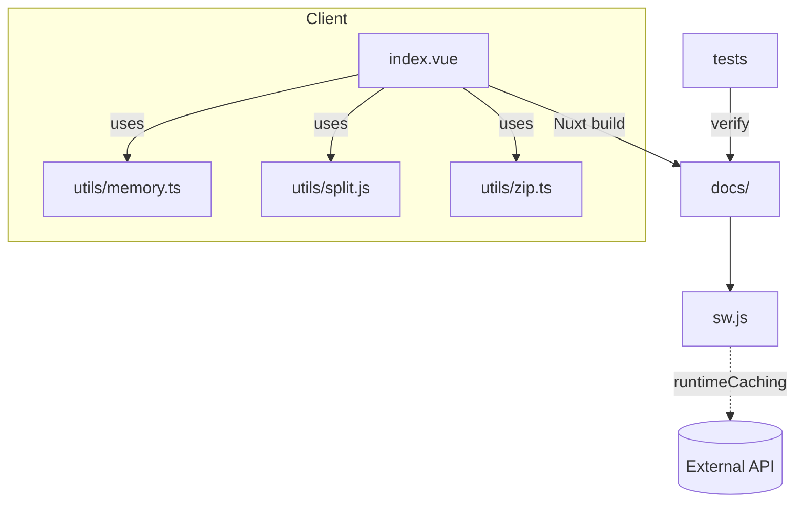

# Project Overview

This document explains the main pieces of the BrainPDF PWA and how they interact.

## Key components

- `pages/index.vue` handles file selection and uses the utility modules.
- `utils/memory.ts` estimates available memory.
- `utils/split.js` divides PDFs by page or size.
- `utils/zip.ts` bundles the resulting parts into a ZIP archive.
- `nuxt.config.ts` configures the PWA and service worker.
- Tests in `tests/` verify service worker creation and PDF splitting.

## Diagram

## Summary

BrainPDF is an offline-capable Nuxt application that allows PDF splitting and optional ZIP bundling entirely on the client. Once a user visits the site online, a service worker caches all assets so the app works without a network connection.
